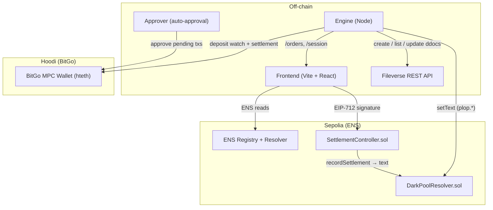
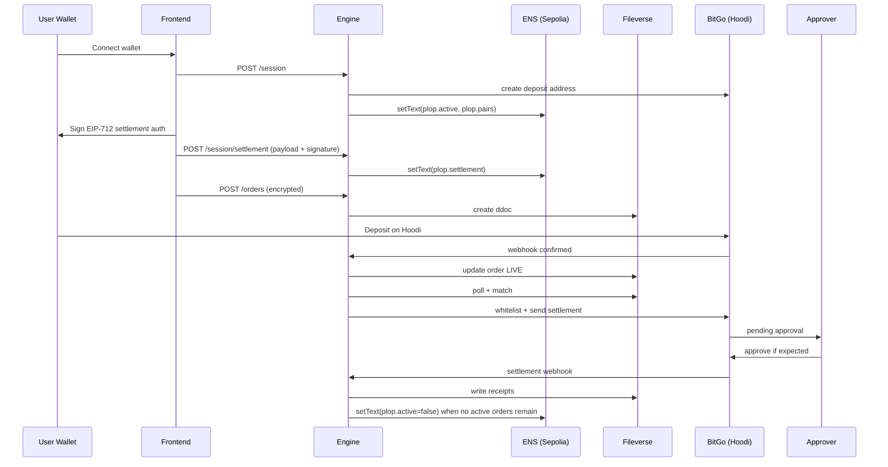

# PLOP - Rotating Dark Pool

Privacy-first OTC liquidity with rotating ENS subnames and MPC settlement.

PLOP is a privacy-preserving OTC dark pool that combines ENS session identities on Sepolia, encrypted off-chain order storage on Fileverse, and BitGo MPC settlement on Hoodi. Orders are hidden until matched, deposits are confirmed via BitGo, and settlement happens on-chain with policy controls.

Contracts (Sepolia):
- DarkPoolResolver.sol: [0x60029f58b742590ebe43a708d15af68289986682](https://sepolia.etherscan.io/address/0x60029f58b742590ebe43a708d15af68289986682)
- SettlementController.sol: [0x39b6356a7cd96bd203174617e41b9535212d06fb](https://sepolia.etherscan.io/address/0x39b6356a7cd96bd203174617e41b9535212d06fb)

This README is the canonical, end-to-end overview: what it does, how the flow works, and how the system is structured.

See detailed build steps in [SETUP.MD](SETUP.MD) and full design notes in [DESCRIPTION.md](DESCRIPTION.md).

## What it does

- Creates anonymous, rotating ENS session subnames on Sepolia (for privacy).
- Stores orders as encrypted Fileverse documents (order book is off-chain).
- Confirms deposits and settles matches using BitGo MPC wallets on Hoodi.
- Supports partial fills with residual orders.
- Refunds cancelled or expired orders automatically.

## Why it matters

- Large trades shouldn’t leak intent or move markets.
- PLOP keeps order flow private while still settling on-chain with institutional-grade controls.
- It proves ENS can be a programmable privacy layer, not just a name registry.

## Why this is different

- ENS is used as a privacy primitive: session subnames are randomized per session and don’t expose the trader’s wallet.
- Orders are encrypted client-side and stored off-chain; the order book is private by default.
- Settlement uses BitGo MPC with whitelists and velocity rules, designed for institutional controls.
- Cross-chain by design: ENS identity on Sepolia, funds on Hoodi.

## Highlights

- Built around ENS session rotation (random subname per session).
- End-to-end flow works today with real testnet deposits and BitGo MPC settlement.
- Privacy is preserved without custom L2s or opaque relayers.

### Architecture diagram



## Core flow (step by step)

1. Wallet connect and session identity
   - User connects MetaMask.
   - UI requests `/session` from engine.
   - Engine:
     - Generates a random subname (example: `a1b2c3.plop.eth`).
     - Creates BitGo deposit address.
     - Writes ENS text records (no deposit address on-chain):
       - `plop.active` = true
       - `plop.pairs` = allowed pairs
       - `plop.receipts` = empty list
   - UI stores `{ensSubname, depositAddress}` locally and reuses it until the session is marked inactive.

2. Settlement authorization (privacy-preserving)
   - UI encrypts a settlement payload with the engine public key.
   - UI signs an EIP-712 message on Sepolia.
   - Engine verifies signature via SettlementController and stores encrypted payload in ENS text:
     - `plop.settlement = plop:v1:<base64(ciphertext)>`

3. Order submission
   - User submits order (pair, side, amount, price, TTL).
   - UI encrypts payload (tweetnacl) with engine public key.
   - UI posts `/orders` to engine.
   - Engine stores encrypted order as a Fileverse ddoc (no plaintext order data; deposit address is embedded in the encrypted payload, not in ENS).
   - Each order includes a slippage tolerance (default 2%, set in the UI) that is enforced at match time.

4. Deposit to BitGo (Hoodi)
   - UI prompts deposit of the **token-in** amount to the BitGo address.
   - BitGo confirms deposit -> webhook -> engine marks order LIVE.

5. Matching and partial fills
   - Engine polls Fileverse ddocs.
   - Matches live orders with price overlap.
   - If partial fill, engine updates ddoc and creates residual order.

6. Settlement (Hoodi)
   - Engine reads explicit settlement recipients from `plop.settlement` (no ENS address fallback).
   - Engine updates BitGo whitelist policy with both parties.
   - ETH pairs: `sendMany()` (atomic).
   - ERC-20 pairs: two `send()` calls (not atomic).

7. Approvals (Option 3 auto-approver)
   - BitGo creates a pending approval for each settlement/refund.
   - The **approver service** validates the recipient + amount against the encrypted order payload and only then approves.
   - If the approval does not match the expected recipient/amount, it is rejected or skipped.

8. Session lifecycle and receipts
   - On settlement confirm, engine writes encrypted receipts to Fileverse and updates `plop.receipts`.
   - `plop.active` is set to `false` only when **no active orders remain** for that subname.

9. Refunds
   - Cancelled or expired orders are refunded via BitGo.
   - If deposit arrives after cancellation, refund watcher sends funds back.

### Flow diagram (sequence)



## Technical walkthrough (from SETUP.MD, FLOW.md, RULES.md)

This section condenses the full build + runtime behavior documented in `SETUP.MD`, `FLOW.md`, and `RULES.md`.

1. Accounts and chain setup  
Create ENS testnet account (Sepolia), BitGo testnet account (Hoodi / hteth), and Fileverse account. Hoodi is the settlement chain (chain ID 560048) and Sepolia is the ENS identity chain (11155111). BitGo whitelist policies have a 48‑hour lock after creation; this is expected for production even if it is inactive during demos.

2. Deploy ENS resolver (DarkPoolResolver.sol)  
Compile and deploy the resolver to Sepolia. It implements ENSIP‑10 wildcard resolution (`resolve`) plus `addr` and `text` for `plop.active`, `plop.pairs`, `plop.receipts`, and `plop.settlement`. After deploy, set `plop.eth` resolver to this contract in the ENS UI. The engine is the only address allowed to call `setText`.

3. Deploy settlement controller (SettlementController.sol)  
Deploy to Sepolia and link it inside the resolver using `setSettlementController`. This contract verifies EIP‑712 signatures (`PlopSettlementController`, version `1`, chainId 11155111) and writes encrypted settlement payloads into `plop.settlement` via the resolver. The payload is encrypted client‑side with the engine public key.

4. Fileverse REST setup  
Enable Developer Mode at `ddocs.new`, create an API key, deploy a Fileverse server, and store `FILEVERSE_SERVER_URL` + `FILEVERSE_API_KEY`. Fileverse is REST‑only; use `createDoc`, `getDoc`, `updateDoc`, and `listDocs` with pagination. Always `waitForSync()` after create/update before using the link. The search API returns `nodes` (not `ddocs`). The API key is passed as a query param.

5. BitGo MPC wallet + policies  
Create MPC keys and a hot wallet using `wallets().add()` (not `generateWallet`). Use coin `hteth` and import `Hteth` for sends. Create a destination whitelist policy and a velocity limit policy, and register a transfer webhook to `/webhooks/bitgo`. At match time the engine **updates** the whitelist via `updatePolicyRule` (never creates new rules).
  
  **Policy + approval behavior**
  - **Whitelist policy**: settlement and refund recipients are added dynamically before sending.
  - **Velocity policy**: caps total outflow; this protects the pool wallet from draining.
  - **Pending approvals**: BitGo can require approvals for transfers; PLOP uses an **optional approver daemon** that validates each approval against the encrypted order payload.
  - If the approver is offline, approvals remain pending and can be approved manually in BitGo.

6. Session creation  
When a wallet connects, the frontend calls `POST /session`. The engine generates a **random subname** (e.g., `a1b2c3.plop.eth`), creates a BitGo deposit address, and writes ENS text records `plop.active=true`, `plop.pairs`, and `plop.receipts`. The deposit address is **returned via the API only** (cached locally and embedded in encrypted orders), not published in ENS. The frontend stores the `ensSubname` and reuses it until the session is marked inactive.

7. Settlement authorization  
The frontend encrypts a settlement payload (recipient, chainId, expiry, nonce) with `ENGINE_PUBLIC_KEY`, signs an EIP‑712 message, and posts to `POST /session/settlement`. The engine verifies the signature through `SettlementController` and writes the ciphertext to `plop.settlement`.

8. Order submission  
Orders are encrypted client‑side with NaCl box and posted to `POST /orders`. The engine stores the encrypted order as a Fileverse ddoc with `PENDING_DEPOSIT`, plus `originalAmount`, `remainingAmount`, `filledAmount`, `submittedAt`, and `ttlSeconds`.

9. Deposits and activation  
BitGo webhooks mark orders LIVE on confirmed deposits. A Hoodi deposit watcher is also available for local testing or when webhooks are unreachable. ERC‑20 deposits use the token balance watcher.

10. Matching and partial fills  
The engine polls Fileverse with `listDocs()` pagination, decrypts LIVE orders, checks TTL based on **root** `submittedAt`, and matches inverse pairs with price overlap. Partial fills update the root order to `PARTIALLY_FILLED_IN_SETTLEMENT` and create a residual ddoc that reuses the same encrypted order and original `submittedAt`.

11. Settlement execution  
   The engine reads explicit settlement recipients from `plop.settlement` (no ENS address fallback), updates the whitelist, and settles with BitGo. ETH pairs use `sendMany()` (atomic). ERC‑20 pairs use two sequential `send()` calls (non‑atomic). Failed sends are not retried to avoid double‑spend risk.

12. Approvals (Option 3 auto-approver)  
    BitGo creates pending approvals for settlement/refund transfers. The approver daemon polls pending approvals and approves only when the recipient + amount exactly match the encrypted order payload (using `ENGINE_SECRET_KEY`). This removes manual approvals while ensuring the engine cannot redirect funds.

13. Session lifecycle + receipts  
    After settlement confirmation, encrypted receipts are written to Fileverse and appended to `plop.receipts` in ENS. The engine sets `plop.active=false` **only when no active orders remain** for that subname.

14. Refunds  
    Cancelled or expired orders are refunded via BitGo. If a deposit arrives after cancellation/expiry, the refund watcher sends it back automatically. Refund metadata (`refundTxHash`, timestamps, error) is persisted and shown in history.

Critical gotchas from the build docs: settlement recipients are required (no ENS address fallback); never use `@fileverse/agents`; `sendMany()` is native ETH only; always update (not create) the whitelist rule; only deactivate a subname when **all** orders are done; and never retry failed ERC‑20 sends.

## Privacy model

- Orders are encrypted client-side before going to Fileverse.
- ENS subnames are randomized per session; session identity is decoupled from wallet address.
- Settlement recipient data is stored encrypted in ENS text records.
- Deposit addresses are returned via the engine API and embedded in encrypted orders, not published in ENS.
- Deposits and settlement happen on Hoodi; ENS stays on Sepolia.
- BitGo creates unique deposit addresses per session/order, reducing linkability. Settlement still comes from the same MPC wallet, so privacy is improved but not absolute.
- Fileverse stores only ciphertext (order payloads + receipts); decryption happens inside the engine at match/settlement time.

## Smart contracts

- `DarkPoolResolver.sol`
  - ENS wildcard resolver (ENSIP-10).
  - Stores text records for `plop.receipts`, `plop.settlement`, `plop.active`, `plop.pairs`.

- `SettlementController.sol`
  - Verifies EIP-712 signatures.
  - Writes encrypted settlement payload to ENS text record.

## Engine endpoints (high level)

- `GET /health` - health check
- `GET /config` - engine public key + settlement controller + Hoodi chainId
- `POST /session` - create session and deposit address
- `POST /session/settlement` - verify EIP-712 signature and write settlement text
- `GET /orders?sessionSubname=...` - session orders
- `GET /orders/all` - global order book (for pool activity)
- `POST /orders` - create order
- `POST /orders/:id/cancel` - cancel and auto-refund
- `POST /webhooks/bitgo` - BitGo webhook receiver

## Frontend behavior

- Session identity card shows the session subname, settlement authorization status, and deposit address (Hoodi).
- Deposit modal prompts MetaMask to send funds to BitGo deposit address.
- Orders tab:
  - Active orders show live states.
  - History includes matched, partial, cancelled, expired, and refund status **across prior session subnames** stored locally for the connected wallet.
  - New orders include a slippage tolerance selector (0.5–5%) used by the matcher.
- Pool activity uses `/orders/all` (global, not only local session).

## Refund logic (cancelled and expired)

- Cancel or expiry triggers refund attempt.
- If deposit already confirmed, refund is sent immediately.
- If deposit arrives later, refund watcher sends automatically.
- History UI shows REFUNDING / REFUNDED / REFUND FAILED.

## ERC-20 settlement caveat

BitGo `sendMany()` works only for native ETH. ERC-20 pairs are settled with two sequential `send()` calls, which are not atomic. If send #2 fails after send #1 succeeds, the engine marks partial settlement and requires manual intervention.

## Tech used

- Frontend: Vite, React, TypeScript, viem
- Crypto: tweetnacl (box encryption)
- Backend: Node, TypeScript, tsx
- ENS: wildcard resolver on Sepolia
- Storage: Fileverse REST API (ddocs)
- Settlement: BitGo MPC hot wallet on Hoodi (hteth)
- Approvals: BitGo auto-approver daemon (optional)

## Quick start (local)

See [SETUP.MD](SETUP.MD) for the complete build steps.

Typical dev commands:

```bash
npm install
npm run engine
npm run approver
npm run dev
```

## Environment variables (high level)

Engine:

- `ETH_SEPOLIA_RPC`
- `ETH_HOODI_RPC`
- `DARK_POOL_RESOLVER_ADDRESS`
- `BITGO_ACCESS_TOKEN`
- `BITGO_ENTERPRISE_ID`
- `BITGO_WALLET_ID`
- `BITGO_WALLET_PASSPHRASE`
- `FILEVERSE_SERVER_URL`
- `FILEVERSE_API_KEY`
- `ENGINE_URL`

Approver (optional, auto-approval):

- `BITGO_ACCESS_TOKEN` (or `APPROVER_BITGO_ACCESS_TOKEN`)
- `BITGO_WALLET_ID`
- `BITGO_WALLET_PASSPHRASE` (or `APPROVER_WALLET_PASSPHRASE`)
- `BITGO_ENTERPRISE_ID` (fallback if walletId is rejected by BitGo pending approvals)
- `ENGINE_SECRET_KEY`
- `APPROVER_POLL_INTERVAL_MS` (default 15000)
- `APPROVER_REJECT_ON_FAIL` (set `0` to skip instead of reject)

Frontend:

- `VITE_ENGINE_URL`
- `VITE_ETH_SEPOLIA_RPC`
- `VITE_DEFAULT_PAIRS`
- `VITE_TOKEN_DECIMALS`
- `VITE_TOKEN_ADDRESS_MAP`
- `VITE_DEFAULT_SLIPPAGE_BPS` (default 200 = 2%)

For the full list, refer to `.env.example` and [SETUP.MD](SETUP.MD).
