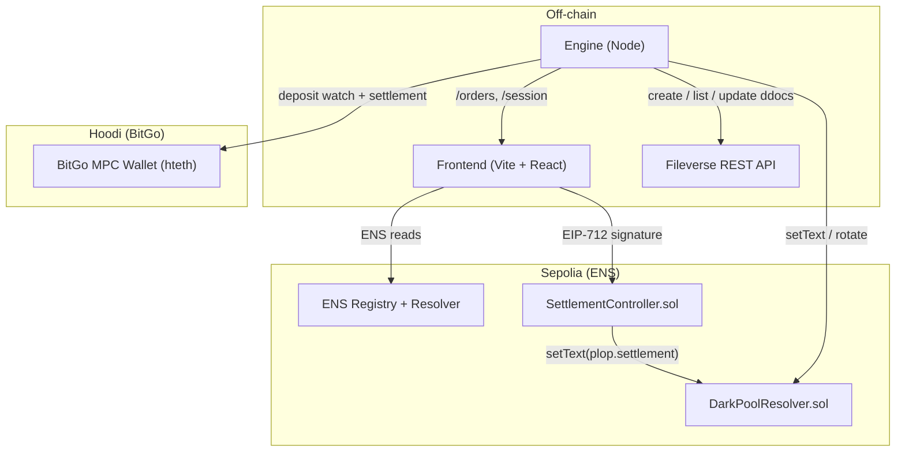
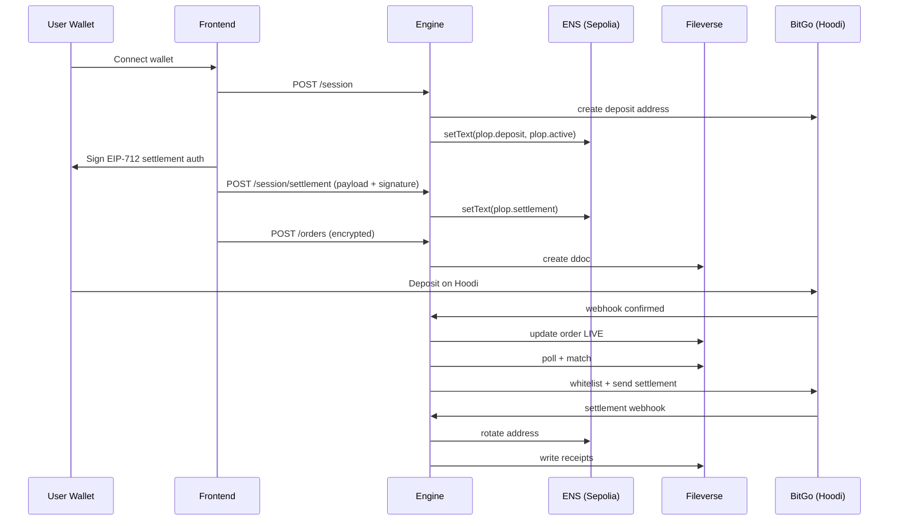

# PLOP - Rotating Dark Pool

Tagline: privacy-first OTC liquidity with rotating ENS identities and MPC settlement.

PLOP is a privacy-preserving OTC dark pool that combines ENS session identities on Sepolia, encrypted off-chain order storage on Fileverse, and BitGo MPC settlement on Hoodi. Orders are hidden until matched, deposits are confirmed via BitGo, and settlement happens on-chain with policy controls.

This README is the canonical, end-to-end overview: what it does, how the flow works, and how the system is structured.

See detailed build steps in [SETUP.MD](SETUP.MD) and full design notes in [DESCRIPTION.md](DESCRIPTION.md).

## What it does

- Creates anonymous, rotating ENS session identities on Sepolia (for privacy).
- Stores orders as encrypted Fileverse documents (order book is off-chain).
- Confirms deposits and settles matches using BitGo MPC wallets on Hoodi.
- Supports partial fills with residual orders.
- Refunds cancelled or expired orders automatically.

## Why this is different

- ENS is used as an actual privacy primitive: session addresses rotate automatically and do not expose the trader’s wallet.
- Orders are encrypted client-side and stored off-chain; the order book is private by default.
- Settlement uses BitGo MPC with whitelists and velocity rules, designed for institutional controls.
- Cross-chain by design: ENS identity on Sepolia, funds on Hoodi.

## Demo highlights

- Built around ENS auto-rotation (explicitly requested in ENS prize briefs).
- End-to-end flow works today with real testnet deposits and BitGo MPC settlement.
- Privacy is preserved without custom L2s or opaque relayers.

### Architecture diagram



## Core flow (step by step)

1. Wallet connect and session identity
   - User connects MetaMask.
   - UI derives subname (example: `0xabc..` -> `abcde.plop.eth`).
   - UI requests `/session` from engine.
   - Engine:
     - Creates BitGo deposit address.
     - Writes ENS text records:
       - `plop.deposit` = BitGo deposit address
       - `plop.active` = true

2. Settlement authorization (privacy-preserving)
   - UI encrypts a settlement payload with the engine public key.
   - UI signs an EIP-712 message on Sepolia.
   - Engine verifies signature via SettlementController and stores encrypted payload in ENS text:
     - `plop.settlement = plop:v1:<base64(ciphertext)>`

3. Order submission
   - User submits order (pair, side, amount, price, TTL).
   - UI encrypts payload (tweetnacl) with engine public key.
   - UI posts `/orders` to engine.
   - Engine stores encrypted order as Fileverse ddoc.

4. Deposit to BitGo (Hoodi)
   - UI prompts deposit to BitGo address for SELL side.
   - BitGo confirms deposit -> webhook -> engine marks order LIVE.

5. Matching and partial fills
   - Engine polls Fileverse ddocs.
   - Matches live orders with price overlap.
   - If partial fill, engine updates ddoc and creates residual order.

6. Settlement (Hoodi)
   - Engine updates BitGo whitelist policy with both parties.
   - ETH pairs: `sendMany()` (atomic).
   - ERC-20 pairs: two `send()` calls (not atomic).

7. Rotation and receipts
   - On settlement confirm, engine rotates ENS address for fully-filled sessions.
   - Engine writes encrypted receipts to Fileverse and updates `plop.receipts`.

8. Refunds
   - Cancelled or expired orders are refunded via BitGo.
   - If deposit arrives after cancellation, refund watcher sends funds back.

### Flow diagram (sequence)



## Privacy model

- Orders are encrypted client-side before going to Fileverse.
- ENS names are rotating; session identity is decoupled from wallet address.
- Settlement recipient data is stored encrypted in ENS text records.
- Deposits and settlement happen on Hoodi; ENS stays on Sepolia.
- BitGo creates unique deposit addresses per session/order, reducing linkability. Settlement still comes from the same MPC wallet, so privacy is improved but not absolute.

## Smart contracts

- `DarkPoolResolver.sol`
  - ENS wildcard resolver (ENSIP-10).
  - Deterministic rotating address per session.
  - Stores text records for `plop.deposit`, `plop.receipts`, `plop.settlement`.

- `SettlementController.sol`
  - Verifies EIP-712 signatures.
  - Writes encrypted settlement payload to ENS text record.

## Engine endpoints (high level)

- `GET /health` - health check
- `GET /config` - engine public key + settlement controller + Hoodi chainId
- `POST /session` - create session and deposit address
- `POST /session/settlement` - verify EIP-712 signature and write settlement text
- `GET /orders?sessionSubname=...` - session orders
- `GET /orders/all` - global order book (for pool activity)
- `POST /orders` - create order
- `POST /orders/:id/cancel` - cancel and auto-refund
- `POST /webhooks/bitgo` - BitGo webhook receiver

## Frontend behavior

- Session identity card resolves ENS (Sepolia) and shows deposit address (Hoodi).
- Deposit modal prompts MetaMask to send funds to BitGo deposit address.
- Orders tab:
  - Active orders show live states.
  - History includes matched, partial, cancelled, expired, and refund status.
- Pool activity uses `/orders/all` (global, not only local session).

## Refund logic (cancelled and expired)

- Cancel or expiry triggers refund attempt.
- If deposit already confirmed, refund is sent immediately.
- If deposit arrives later, refund watcher sends automatically.
- History UI shows REFUNDING / REFUNDED / REFUND FAILED.

## ERC-20 settlement caveat

BitGo `sendMany()` works only for native ETH. ERC-20 pairs are settled with two sequential `send()` calls, which are not atomic. If send #2 fails after send #1 succeeds, the engine marks partial settlement and requires manual intervention.

## Tech used

- Frontend: Vite, React, TypeScript, viem
- Crypto: tweetnacl (box encryption)
- Backend: Node, TypeScript, tsx
- ENS: wildcard resolver on Sepolia
- Storage: Fileverse REST API (ddocs)
- Settlement: BitGo MPC hot wallet on Hoodi (hteth)

## Quick start (local)

See [SETUP.MD](SETUP.MD) for the complete build steps.

Typical dev commands:

```bash
npm install
npm run engine
npm run dev
```

## Environment variables (high level)

Engine:

- `ETH_SEPOLIA_RPC`
- `ETH_HOODI_RPC`
- `DARK_POOL_RESOLVER_ADDRESS`
- `BITGO_ACCESS_TOKEN`
- `BITGO_ENTERPRISE_ID`
- `BITGO_WALLET_ID`
- `BITGO_WALLET_PASSPHRASE`
- `FILEVERSE_SERVER_URL`
- `FILEVERSE_API_KEY`
- `ENGINE_URL`

Frontend:

- `VITE_ENGINE_URL`
- `VITE_ETH_SEPOLIA_RPC`
- `VITE_DEFAULT_PAIRS`
- `VITE_TOKEN_DECIMALS`
- `VITE_TOKEN_ADDRESS_MAP`

For the full list, refer to `.env.example` and [SETUP.MD](SETUP.MD).
